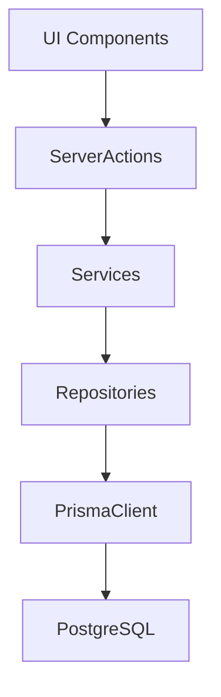

# Plan de trabajo Web Agencia de Viajes

## 1. Infraestructura base y estructura del proyecto

- **1.1. Verificación de stack y App Router**
  - Confirmar que el proyecto está usando App Router (`app/`) y TypeScript estricto (`strict: true`) en `tsconfig.json`.
  - Revisar configuración de Tailwind en `[tailwind.config.js](tailwind.config.js)` y `postcss.config.js`.
- **1.2. Configuración de paths y librerías core**
  - Definir alias en `tsconfig.json` (`@/features`, `@/components`, `@/lib`, `@/generated`).
  - Revisar `[src/lib/db.ts](src/lib/db.ts)` y `[prisma/schema.prisma](prisma/schema.prisma)` para asegurar que el cliente Prisma se genera en `src/generated/prisma`.
- **1.3. Estructura por features**
  - Estandarizar estructura:
    - `src/features/packages/{actions.ts,service.ts,repository.ts,schemas.ts,components/}`.
    - `src/features/auth/{actions.ts,service.ts,repository.ts,schemas.ts,components/}`.
    - `src/features/admin/{components/, layouts/}`.
  - Definir carpeta de UI compartida: `src/components/ui` para componentes atómicos.

---

## 2. Sistema de diseño y layout global

- **2.1. Tokens de diseño globales**
  - Definir variables CSS (o theme Tailwind) para:
    - Colores base: fondo, fondo suave, texto, acento, borde.
    - Tipografía: escalas para `display`, `h1–h4`, `body`, `caption`.
    - Radius y sombras modernas.
  - Centralizar estos tokens en `[src/styles/globals.css](src/styles/globals.css)` y `tailwind.config.js`.
- **2.2. Componentes UI reutilizables (2026 style)**
  - Crear en `src/components/ui`:
    - `Button`, `Input`, `Textarea`, `Select`, `Card`, `Badge`, `Section`, `PageShell`, `Dialog` (opcional).
  - Implementar variantes y tamaños con Tailwind (y si se desea, con un pequeño helper de `cva` o similar).
- **2.3. Layouts principales**
  - Definir `app/layout.tsx` como layout raíz con tipografía, fondo y container.
  - Crear layout público `app/(public)/layout.tsx` para la landing.
  - Crear layout de administración `app/admin/layout.tsx` con sidebar/topbar.

---

## 3. Feature: Landing Page pública

- **3.1. Estructura de rutas pública**
  - Definir `app/(public)/page.tsx` como landing principal.
  - Opcional: crear componentes de secciones en `src/features/landing/components`.
- **3.2. Sección Hero**
  - Componente `Hero` con:
    - Título, subtítulo, imagen/fondo hero.
    - CTAs: "Ver paquetes" (scroll a sección Packages) y "Consultar por WhatsApp".
  - Integrar botón de WhatsApp reutilizable (link aún estático o con helper básico).
  - Quiero que el Hero tenga un diseño como el que se encuentra en 'C:\workspacePersonal\travel-agency\public\HeroExample.png'
- **3.3. Sección Packages (pública)**
  - Componente `PublicPackagesSection` en `src/features/packages/components/PublicPackagesSection.tsx`.
  - Server component que llama a `listPackages` desde `service.ts`.
  - Card de paquete con `image`, `title`, `startDate` formateada.
  - La seccion debe tener un diseño como el que se encuetnra en 'C:\workspacePersonal\travel-agency\public\PackagesExample.png'
- **3.4. Filtro por fecha de inicio**
  - Diseño de filtro en la landing (por ejemplo, input de fecha "Desde").
  - Soportar `searchParams` en `page.tsx` y pasarlos al service.
  - Extender `repository.findAll` para aceptar criterios de filtro por `startDate >=`.
- **3.5. Sección Services y Contact**
  - `ServicesSection`: lista de servicios, inicialmente hardcodeada, en `src/features/landing/components/ServicesSection.tsx`.
  - `ContactSection`: texto de contacto + botón de WhatsApp + posibles links secundarios (email, teléfono).

---

## 4. Feature: Gestión de Paquetes (Admin)

- **4.1. Rutas de administración**
  - Crear `app/admin/page.tsx` (dashboard simple o redirect a `/admin/packages`).
  - Crear `app/admin/packages/page.tsx` para listado.
- **4.2. Listado de paquetes**
  - Server component que usa `listPackages` para mostrar tabla/grid con:
    - `title`, `startDate`, acciones (Editar, Eliminar).
  - Reutilizar componentes `Card` o una tabla minimalista.
- **4.3. Creación de paquetes**
  - Formulario `CreatePackageForm` en `src/features/packages/components/CreatePackageForm.tsx`.
  - Usar `createPackageAction` de `[src/features/packages/actions.ts](src/features/packages/actions.ts)` como server action.
  - Manejar estados de envío y error con `useFormStatus` y validación con Zod (`CreatePackageSchema`).
  - Revisar `revalidatePath` para actualizar tanto admin como landing (ej. `/`, `/admin/packages`).
- **4.4. Edición de paquetes**
  - Extender `repository.ts` con `findById` y `update`.
  - Crear funciones `getPackageById` y `updatePackage` en `service.ts`.
  - Definir server action `updatePackageAction` en `actions.ts`.
  - Crear página `app/admin/packages/[id]/page.tsx` con formulario de edición que reutiliza el schema de Zod.
- **4.5. Eliminación de paquetes**
  - Añadir `deleteById` en `repository.ts` y `deletePackage` en `service.ts`.
  - Crear `deletePackageAction` en `actions.ts`.
  - UI: botón de eliminar con confirmación (modal simple o `window.confirm` inicial) y revalidación de rutas.

---

## 5. Feature: Autenticación y protección de admin

- **5.1. Elección y configuración de auth**
  - Definir si se usará `next-auth` (recomendado) u otra solución.
  - Crear configuración en por ejemplo `[src/app/api/auth/[...nextauth]/route.ts](src/app/api/auth/[...nextauth]/route.ts)` si se usa `next-auth`.
- **5.2. Modelo de usuario y roles**
  - Extender `[prisma/schema.prisma](prisma/schema.prisma)` con modelo `User` y campo de rol (`role` o `isAdmin`).
  - Migrar base de datos y ajustar `db`.
- **5.3. Pantalla de login**
  - Crear `app/login/page.tsx` con formulario minimalista.
  - Implementar server action o handler para login (dependiendo de la librería elegida).
- **5.4. Protección de rutas de admin**
  - Implementar middleware (`middleware.ts`) o guard en `app/admin/layout.tsx` que verifique sesión/rol.
  - Redirigir a `/login` si el usuario no es admin.

---

## 6. Feature: Integración de WhatsApp

- **6.1. Configuración y helper**
  - Añadir variables en `.env` como `NEXT_PUBLIC_WHATSAPP_PHONE` y `NEXT_PUBLIC_WHATSAPP_DEFAULT_MESSAGE`.
  - Crear helper en `[src/lib/whatsapp.ts](src/lib/whatsapp.ts)` para construir la URL `wa.me` codificando el mensaje.
- **6.2. Componente `WhatsAppButton`**
  - Crear `src/components/ui/WhatsAppButton.tsx` que use el helper y acepte props como `label` y `presetMessageKey`.
  - Reutilizarlo en `Hero` y `ContactSection`.

---

## 7. Calidad de código, DX y tests

- **7.1. ESLint y formateo**
  - Revisar configuración de ESLint para Next + TS.
  - Añadir reglas sensatas (no any implícito, imports ordenados, etc.).
  - Asegurar script `lint` y `format` en `package.json`.
- **7.2. Validación y manejo de errores**
  - Extender uso de Zod en features nuevas (auth, update de paquetes, etc.).
  - Centralizar manejo de errores de server actions (por ejemplo, patrones de retorno tipo `{success, error}`) y mostrarlos en UI.
- **7.3. Tests básicos**
  - Tests unitarios para `service.ts` de `packages` (crear, listar, actualizar, eliminar con mocks de repo).
  - Opcional: tests de integración ligeros para una página crítica (landing o admin/packages).

---

## 8. Refinamiento visual y UX 2026

- **8.1. Microinteracciones y animaciones**
  - Añadir transiciones suaves en botones/cards.
  - Opcional: usar Framer Motion en secciones de la landing (hero, packages, services) para animaciones on-scroll.
- **8.2. Accesibilidad mínima**
  - Revisar contraste de colores.
  - Añadir `aria-label` en botones icónicos (WhatsApp, cerrar modal, etc.).
  - Asegurar foco visible y navegación por teclado.
- **8.3. Performance y optimización**
  - Usar `next/image` para imágenes de paquetes.
  - Revisar tamaño de fuentes/librerías y lazy loading de secciones pesadas.

---

## 9. Documentación y reutilización como base

- **9.1. Documentar arquitectura**
  - Actualizar `[README.md](README.md)` con explicación del flujo UI → Action → Service → Repository → Prisma.
  - Documentar cómo crear un nuevo feature siguiendo esta estructura.
- **9.2. Plantilla de feature**
  - Crear un pequeño template (documentado en README o en `docs/`) con ejemplos de `actions.ts`, `service.ts`, `repository.ts`, `schemas.ts` para copiar-pegar.

Este plan está pensado para que puedas ir eligiendo features por bloque (por ejemplo: "Landing pública", "Admin de paquetes", "Auth", "WhatsApp") y avanzar de forma incremental, manteniendo siempre la arquitectura limpia y preparada para escalar.